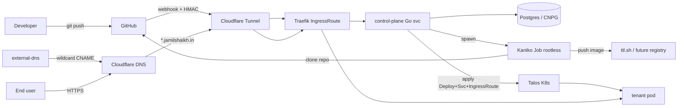

# vercel-clone

A self-hosted PaaS (Platform-as-a-Service) that aims to replicate the Vercel
deployment experience — connect a GitHub repo, `git push`, get a live URL —
on a bare-metal Talos Linux Kubernetes cluster.

> ⚠️ **Status:** work in progress, MVP slice. Build pipeline and webhook
> identity work end-to-end. Automated push → deploy is the next slice.

---

## High-level architecture



### Component breakdown

| Component | Tech | Role |
|---|---|---|
| **Edge / TLS** | Cloudflare Tunnel + Universal SSL | Public entrypoint, no port-forward, free certs |
| **Ingress** | Traefik `IngressRoute` CRD | L7 routing per host |
| **DNS** | external-dns → Cloudflare | Wildcard CNAME automation |
| **Control plane** | Go (`net/http`, `pgx/v5`, `embed`) | Webhook ingest, dispatch, persistence |
| **Database** | CloudNativePG `Cluster` (single instance for MVP) | Installations, projects, deployments, full webhook audit |
| **Builder** | Kaniko rootless `Job`s | Clone-from-git + `Dockerfile` build, no Docker daemon |
| **Registry** | `ttl.sh` (ephemeral, 24h) for now | To be replaced with self-hosted `registry:2` on MinIO |
| **Identity** | GitHub App + HMAC-SHA256 webhooks | Per-repo install + verifiable event delivery |
| **PSA** | `restricted` for tenants, `baseline` for builders | Tenant code can't break out; Kaniko has the broader perms it needs |

---

## Repo layout

```
.
├── README.md              human-facing docs (this file)
├── CLAUDE.md              guide for AI coding agents working in this repo
├── prompt.md              original design brief
├── architecture.md        deeper architecture / decision log
├── control-plane/         Go service (webhook receiver + persistence)
│   ├── main.go            HTTP server, signal handling, env config
│   ├── migrate.go         embed.FS migration runner
│   ├── store.go           pgx-backed repo layer
│   ├── migrations/        *.sql migrations applied at boot
│   └── Dockerfile         multi-stage Go → distroless build
├── manifests/             cluster manifests (apply in numbered order)
│   ├── 00-paas-system-namespace.yaml
│   ├── 01-kaniko-build-hello.yaml      sample-app build Job
│   ├── 02-deploy-hello.yaml            sample-app Deploy+Svc+IngressRoute
│   ├── 03-build-control-plane.yaml     control-plane build Job
│   ├── 04-deploy-control-plane.yaml    control-plane Deploy+Svc+IngressRoute
│   └── 05-paas-db.yaml                 CNPG Cluster (paas-db)
├── samples/
│   └── hello-app/         minimal nginx page used as the build pipeline smoke test
└── tools/
    └── setup-gh-app/      one-shot CLI: drives GitHub App manifest flow + writes K8s secrets
```

---

## Live URLs

| URL | What |
|---|---|
| `https://paas.jamilshaikh.in/healthz` | Control-plane liveness |
| `https://paas.jamilshaikh.in/readyz`  | Control-plane + DB readiness |
| `https://paas.jamilshaikh.in/webhooks/github` | HMAC-verified webhook intake |
| `https://paas.jamilshaikh.in/admin/deployments` | Recent deployments (JSON, no auth yet) |
| `https://sample-paas.jamilshaikh.in/` | First tenant app — built by Kaniko, served by nginx |

---

## What's working today

- ✅ Cloudflare Tunnel → Traefik → pod path validated by two real services
- ✅ Wildcard DNS automation via external-dns; per-deploy hosts work
- ✅ Rootless in-cluster builds via Kaniko on Talos under PSA `baseline`
- ✅ GitHub App + HMAC-signed webhooks delivered to the control plane
- ✅ Postgres (CNPG) with idempotent schema migrations baked into the binary
- ✅ Webhook delivery audit log (every event persisted with `delivery_id` as PK)
- ✅ Dispatched events: `installation`, `installation_repositories`, `push`
- ✅ Push to a connected repo creates a `queued` deployment row

## What's next

1. **Build orchestration** — on `push`, mint a GitHub installation token, spawn a Kaniko Job, watch it, then apply Deployment + Service + IngressRoute
2. **Real registry** — replace `ttl.sh` with `registry:2` on MinIO at `registry.jamilshaikh.in`
3. **Real-time logs** — WebSocket stream of build pod stdout
4. **Dashboard UI** — Next.js app at `https://paas.jamilshaikh.in/dashboard`
5. **Multi-tenant auth** — proper OAuth + per-account access controls
6. **Framework auto-detect** — `next.js`, `vite`, static, etc. (currently `Dockerfile` only)
7. **Postgres HA** — 3-instance CNPG with sync replicas + scheduled backups to MinIO/S3

See `architecture.md` for the deeper design rationale.

---

## Development

Local Go build (control plane):

```bash
cd control-plane
GOTOOLCHAIN=local go build .
```

The repo currently targets Go 1.22 because that's the toolchain on the
dev box; bumping to 1.23+ is fine when needed.

### Deploy from scratch

Apply manifests in numbered order. Each one's header comment explains
what it does and what out-of-band steps (e.g. `setup-gh-app`) are needed
before it makes sense to apply it.

```bash
kubectl apply -f manifests/00-paas-system-namespace.yaml
kubectl apply -f manifests/05-paas-db.yaml         # wait for healthy
kubectl apply -f manifests/03-build-control-plane.yaml
kubectl apply -f manifests/04-deploy-control-plane.yaml
```

The webhook secret is created out-of-band:

```bash
kubectl -n paas-system create secret generic github-webhook \
  --from-literal=secret=$(openssl rand -hex 32)
```

Then create a GitHub App via the helper, which also writes the
remaining secrets:

```bash
cd tools/setup-gh-app
go build .
./setup-gh-app
```

---

## License

TBD.
