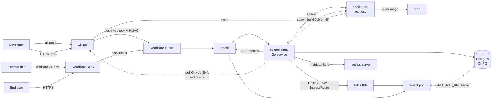

# vercel-clone

A self-hosted PaaS that replicates the Vercel deployment experience —
connect a GitHub repo, `git push`, get a live URL — on a bare-metal
Talos Linux Kubernetes cluster running in a home-lab.

> ✅ **Status:** end-to-end automation, multi-tenant, with live telemetry,
> per-app Postgres, env-var management, runtime log streaming, and a
> self-rebuilding control-plane. Push to this repo's `main` and the
> control-plane itself redeploys within ~3 minutes.
> See [`architecture.md`](./architecture.md) for the full design, C4
> diagrams, and security model.

> **Live dashboard:** https://spinup.in

---

## High-level architecture



### Component breakdown

| Component | Tech | Role |
|---|---|---|
| **Edge / TLS** | Cloudflare Tunnel + Universal SSL | Public entrypoint, no port-forward, free certs |
| **Ingress** | Traefik `IngressRoute` CRD | L7 routing per host |
| **DNS** | external-dns → Cloudflare | Wildcard CNAME automation |
| **Control plane** | Go (`net/http`, `pgx/v5`, `embed`) | Webhook ingest, dispatch, persistence |
| **Database** | CloudNativePG `Cluster` (single instance for MVP) | Installations, projects, deployments, full webhook audit |
| **Builder** | Kaniko rootless `Job`s | Clone-from-git + `Dockerfile` build, no Docker daemon |
| **Registry** | `ttl.sh` (ephemeral, 24h) for now | To be replaced with self-hosted `registry:2` on MinIO |
| **Identity** | GitHub App + HMAC-SHA256 webhooks | Per-repo install + verifiable event delivery |
| **PSA** | `restricted` for tenants, `baseline` for builders | Tenant code can't break out; Kaniko has the broader perms it needs |

---

## Repo layout

```
.
├── README.md              human-facing docs (this file)
├── CLAUDE.md              guide for AI coding agents working in this repo
├── prompt.md              original design brief
├── architecture.md        deeper architecture / decision log
├── control-plane/         Go service (webhook receiver + persistence)
│   ├── main.go            HTTP server, signal handling, env config
│   ├── migrate.go         embed.FS migration runner
│   ├── store.go           pgx-backed repo layer
│   ├── migrations/        *.sql migrations applied at boot
│   └── Dockerfile         multi-stage Go → distroless build
├── manifests/             cluster manifests (apply in numbered order)
│   ├── 00-paas-system-namespace.yaml
│   ├── 01-kaniko-build-hello.yaml      sample-app build Job
│   ├── 02-deploy-hello.yaml            sample-app Deploy+Svc+IngressRoute
│   ├── 03-build-control-plane.yaml     control-plane build Job
│   ├── 04-deploy-control-plane.yaml    control-plane Deploy+Svc+IngressRoute
│   └── 05-paas-db.yaml                 CNPG Cluster (paas-db)
├── samples/
│   └── hello-app/         minimal nginx page used as the build pipeline smoke test
└── tools/
    └── setup-gh-app/      one-shot CLI: drives GitHub App manifest flow + writes K8s secrets
```

---

## Live URLs

| URL | What |
|---|---|
| `https://spinup.in/` | Dashboard (OAuth-gated) |
| `https://spinup.in/healthz` | Liveness probe |
| `https://spinup.in/readyz` | Readiness (CP + DB) |
| `https://spinup.in/webhooks/github` | HMAC-verified webhook intake |
| `https://<slug>.spinup.in/` | Production alias for an app |
| `https://<slug>-<sha7>.spinup.in/` | Per-commit preview URL |

---

## What's working today

**Deploy pipeline**
- Cloudflare Tunnel → Traefik → tenant pod (no port-forward, free TLS)
- Wildcard CNAMEs via `external-dns`: `<slug>.host` (prod alias) + `<slug>-<sha>.host` (preview)
- Rootless in-cluster builds via Kaniko, PSA `restricted` on tenant pods
- GitHub App + HMAC-verified push webhooks → idempotent build queue
- Full webhook audit log (every delivery persisted, dedupe via `delivery_id` PK)

**Dashboard** (single-page app embedded in the Go binary)
- GitHub OAuth login + HMAC-signed session cookies
- Two-rail navigation: main rail (Home / Monitoring) + sub-sidebar (per-app)
- Light / dark theme toggle with no flash-of-wrong-theme on load
- Version pill: shows the commit SHA actually running, sourced from the rebuilder state ConfigMap
- Apps grid on Home with per-app status pills
- Per-app pages: Overview, build/runtime logs (SSE), Database, SQL viewer, Env vars
- Redeploy / rollback button on any past deployment
- Telemetry & Traffic pages: live CPU / memory / requests / errors / avg-latency per app, refreshed every 5s

**Tenant-facing features**
- One-click per-project Postgres (creates a dedicated role + DB, drops `DATABASE_URL` as a tenant Secret, materialised on next build)
- Browser SQL viewer scoped to the tenant DB
- Env-var CRUD; values applied to the next build (and surfaced via redeploy)
- Runtime log SSE that tails the live tenant pod's stdout (not just the build log)

**Operations**
- Self-rebuilding control-plane: a goroutine polls GitHub every 90s, rebuilds the image via Kaniko on diff, and rolls the Deployment with `maxUnavailable: 0`
- `RequeueStuck` reconciler on boot (recovers stranded `building` rows after pod restart)
- Manual escape hatch script: `scripts/rebuild-control-plane.sh`

## What's next (deliberately deferred)

1. **Self-hosted registry** — replace `ttl.sh` with `registry:2` on MinIO once the 24h TTL becomes a real issue
2. **Postgres HA** — 3-instance CNPG with sync replicas + scheduled backups
3. **Framework auto-detect** — buildpacks for next.js / vite / static (today: bring a `Dockerfile`)
4. **gVisor / Kata** — tenant kernel isolation (current threat model is covered by PSA `restricted` + NetworkPolicies)
5. **Persistent log storage** — Loki sidecar so logs survive pod restarts
6. **Real-time request rate** — today the dashboard shows lifetime Traefik counters; a rate view needs a Prom sidecar or in-process EWMA

See [`architecture.md`](./architecture.md) for the C4 diagrams, request-flow sequence, self-rebuild loop, and security model.

---

## Development

Local Go build (control plane):

```bash
cd control-plane
GOTOOLCHAIN=local go build .
```

The repo currently targets Go 1.22 because that's the toolchain on the
dev box; bumping to 1.23+ is fine when needed.

### Deploy from scratch

Apply manifests in numbered order. Each one's header comment explains
what it does and what out-of-band steps (e.g. `setup-gh-app`) are needed
before it makes sense to apply it.

```bash
kubectl apply -f manifests/00-paas-system-namespace.yaml
kubectl apply -f manifests/05-paas-db.yaml         # wait for healthy
kubectl apply -f manifests/03-build-control-plane.yaml
kubectl apply -f manifests/04-deploy-control-plane.yaml
```

The webhook secret is created out-of-band:

```bash
kubectl -n paas-system create secret generic github-webhook \
  --from-literal=secret=$(openssl rand -hex 32)
```

Then create a GitHub App via the helper, which also writes the
remaining secrets:

```bash
cd tools/setup-gh-app
go build .
./setup-gh-app
```

### GitHub App permissions

`setup-gh-app` requests these repository permissions in the App manifest
(see `tools/setup-gh-app/main.go` → `DefaultPerms`):

| Permission | Level | Why |
|---|---|---|
| `contents` | **Read & write** | Clone for builds (read) **and** the Insights "Open improvement PR" flow, which creates a branch + commits SEO fixes (write) |
| `pull_requests` | **Read & write** | Open the draft improvement PR |
| `metadata` | Read | Required baseline |
| `statuses` | Write | Commit status checks on builds |
| `checks` | Write | Check runs |
| `deployments` | Write | Deployment status |

Apps created **before** `contents`/`pull_requests` were bumped to *write*
will deploy fine but **403 on the "Open improvement PR" button**. To fix
an existing install:

1. **App owner**: github.com → *Settings → Developer settings → GitHub
   Apps → Spinup → Permissions* → set **Contents** and **Pull requests**
   to *Read & write*, save.
2. **Repo owner**: github.com → *Settings → Applications → Installed
   GitHub Apps → Spinup → Configure* → approve the pending permission
   update (GitHub also emails an approval link).

---

## License

TBD.
