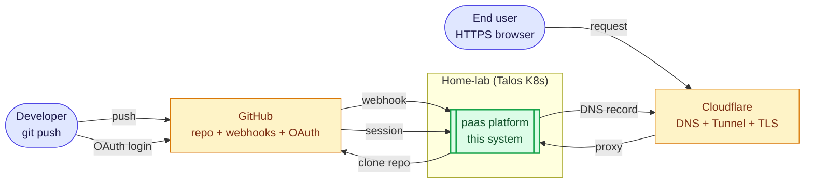
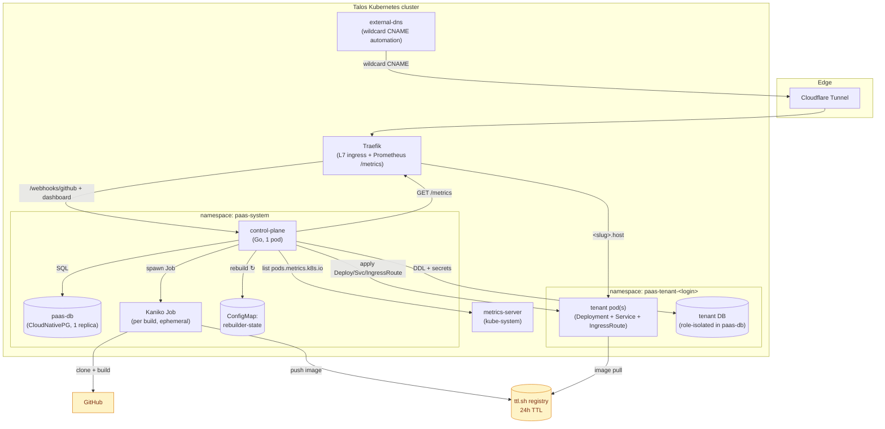
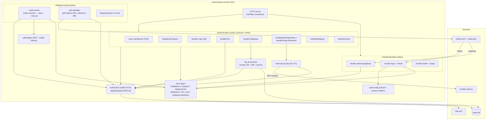
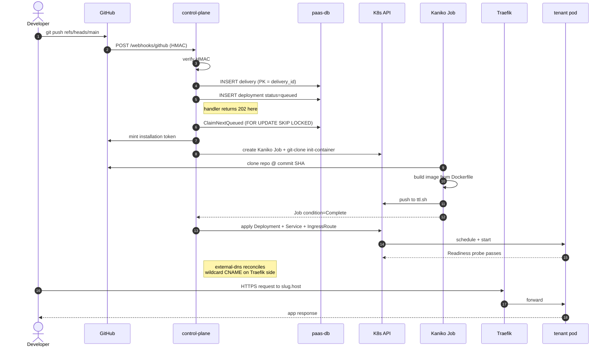
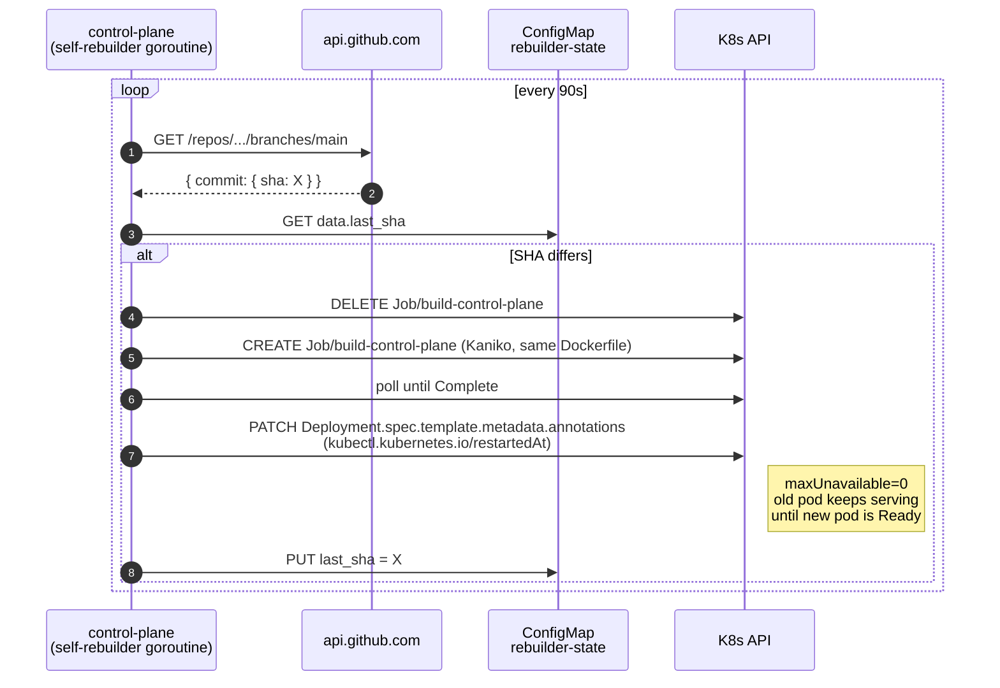

# Architecture

A self-hosted, multi-tenant PaaS that runs entirely on a bare-metal Talos
Kubernetes cluster. End-to-end: a developer pushes to a connected GitHub
repo and ~3 minutes later the new revision is live behind an HTTPS URL,
with build/runtime logs, env-var management, per-app Postgres, and CPU/
memory/request telemetry surfaced in a dashboard. No SaaS dependencies
beyond GitHub itself.

This document follows the [C4 model](https://c4model.com/) — three
zoom levels from "where this system sits in the world" to "what's
inside the control-plane process". Each diagram is a Mermaid block so it
renders inline on GitHub.

* [System context (L1)](#system-context-l1) — actors, external systems
* [Containers (L2)](#containers-l2) — major runtime processes
* [Components (L3)](#components-l3) — what's inside the control-plane
* [Request flow](#request-flow-a-push-to-live-url-walkthrough) — sequence
* [Trust + isolation](#trust--isolation) — security model
* [What we've shipped](#whats-shipped) — feature audit

---

## System context (L1)



**External dependencies**

| System | Role |
|---|---|
| **GitHub** | Source of code + push webhooks + OAuth identity provider |
| **Cloudflare** | Public DNS, TLS termination, and a Tunnel that gives the homelab an outside-the-firewall endpoint without port-forwarding |

Everything else — build pipeline, registry, database, dashboard, telemetry —
runs inside the home-lab cluster.

---

## Containers (L2)



**What each container does**

| Container | Purpose | Notes |
|---|---|---|
| **Cloudflare Tunnel** | Outside-the-firewall edge | No port-forward; Cloudflare-issued certs |
| **Traefik** | L7 ingress, per-host routing, Prometheus `/metrics` for telemetry | Three replicas |
| **external-dns** | Reconciles wildcard CNAMEs to Cloudflare | Triggered by IngressRoute creates |
| **control-plane** | The brain — see L3 below | Single Go pod, ~5MB binary |
| **paas-db (CNPG)** | Platform Postgres + tenant DBs | Single instance for MVP; HA next |
| **Kaniko Job** | Rootless image build | Spawned per deployment, TTL-cleaned |
| **rebuilder-state ConfigMap** | `last_sha` of the self-built control-plane image | Source-of-truth for `/v1/version` |
| **tenant pod** | The user's app | Per-tenant namespace; PSA `restricted` |
| **metrics-server** | Pod CPU/memory | Standard kube-system install |

---

## Components (L3) — inside the control-plane



**Component-by-component**

| Component | File(s) | Role |
|---|---|---|
| HTTP server + routing | `main.go` | One `ServeMux`, `requireUser` middleware splits HTML vs JSON 401 |
| webhook receiver | `main.go::handleGitHubWebhook` | HMAC-verifies, persists delivery, dispatches to push/installation handlers |
| OAuth + sessions | `auth.go` | GitHub OAuth → HMAC-signed session cookie; `requireUser` middleware |
| store (DB layer) | `store.go` | pgx queries, idempotent migrations baked in via `embed.FS` |
| kubeClient | `k8s.go` | Tiny stdlib-only K8s client — avoids 30MB of client-go |
| build worker | `worker.go` | Claims `queued` deployments, spawns Kaniko Job, watches, applies Deploy/Svc/IngressRoute |
| self-rebuilder | `self_rebuild.go` | Polls GitHub SHA every 90s, rebuilds the control-plane image on diff |
| telemetry | `telemetry.go` + `telemetry_handlers.go` | Fuses `metrics.k8s.io` + Traefik `/metrics`, 5s cache |
| env-var API | `env_handlers.go` | CRUD on `env_vars` rows; secret materialised into K8s on next build |
| DB provisioner | `db_provisioner.go` + `database_handlers.go` | Creates Postgres role + DB + writes `DATABASE_URL` Secret into the tenant namespace |
| dashboard | `static/dashboard.html` | Single-file SPA (HTML + CSS + JS, embedded) |

---

## Request flow: a push to live URL walkthrough



Idempotency: every step is safe to retry. If the control-plane pod
crashes mid-build, `RequeueStuck` on boot picks up any `building` row
whose Job no longer exists.

---

## The self-rebuild loop



Safety properties:

| Failure mode | Outcome |
|---|---|
| New commit fails to build | Job ends `Failed` → no rollout → old pod keeps serving |
| New image starts but crashes | `maxUnavailable: 0` + readiness probe → old pod keeps serving |
| Self-rebuilder logic itself broken | Escape hatch: `scripts/rebuild-control-plane.sh` |

---

## Trust + isolation

| Boundary | Mechanism |
|---|---|
| Public → cluster | Cloudflare Tunnel (no port-forward, no exposed IPs) |
| GitHub → control-plane | HMAC-SHA256 over webhook body, `X-Hub-Signature-256` |
| Browser → control-plane | OAuth (GitHub App) → HMAC-signed session cookie, `SameSite=Lax` |
| Control-plane RBAC | Namespaced Role for paas-system; ClusterRole for tenant resources only |
| Tenant code → host | PSA `restricted` (no root, no host paths, drop ALL caps, RuntimeDefault seccomp) |
| Tenant ↔ tenant | NetworkPolicy: deny-all + per-namespace allow |
| Build pod ↔ tenant secrets | Kaniko runs in `paas-system` only; never sees tenant namespaces |
| Tenant DB role | Owns its DB only; no superuser; tenant pods can't reach other tenants' DBs (NetworkPolicy on CNPG service) |
| Resource starvation | `ResourceQuota` + `LimitRange` per tenant namespace |

---

## What's shipped

| Capability | Status | Files / notes |
|---|---|---|
| GitHub App + OAuth login | ✅ | `auth.go`, `tools/setup-gh-app/` |
| HMAC-verified push webhooks | ✅ | `main.go::handleGitHubWebhook` |
| Persistent webhook audit log | ✅ | `migrations/0001_initial.sql` |
| Idempotent build worker | ✅ | `worker.go` + `store.go::ClaimNextQueued` |
| In-cluster Kaniko builds | ✅ | `manifests/03-build-control-plane.yaml` (template), worker builds tenant Jobs in Go |
| Cloudflare Tunnel + external-dns + wildcard hosts | ✅ | gitops repo |
| Per-deployment URL + production alias | ✅ | `<slug>-<sha>.host` + `<slug>.host` |
| Build log SSE | ✅ | `main.go::handleDeploymentLogs` |
| Runtime log SSE (tenant pod tail) | ✅ | `main.go::handleDeploymentRuntimeLogs` |
| Env-var CRUD + materialised to K8s on next build | ✅ | `env_handlers.go` |
| Per-project Postgres (one click) | ✅ | `db_provisioner.go` + `database_handlers.go` |
| SQL viewer (browser-side query editor) | ✅ | dashboard SQL page |
| Redeploy / rollback (re-run a past commit) | ✅ | `handleRedeploy` |
| Telemetry: per-app CPU/memory/requests/latency | ✅ | `telemetry.go` (metrics-server + Traefik scrape) |
| Two-rail dashboard navigation (sidebar + sub-sidebar) | ✅ | `static/dashboard.html` |
| Light / dark theme + persisted preference | ✅ | `data-theme` on `<html>`, pre-paint bootstrap |
| Version pill (commit SHA from rebuilder state CM) | ✅ | `version_handler.go` + dashboard `loadVersion()` |
| **Auto-deploy on push to this repo's own main** | ✅ | `self_rebuild.go` — 90s poll → Kaniko → rollout |

---

## What's next (deliberately deferred)

| Item | Why deferred |
|---|---|
| Self-hosted registry (replace ttl.sh) | Working with MinIO + `registry:2` is straightforward; the 24h TTL hasn't bitten us yet |
| Postgres HA (3-instance CNPG) | One replica is fine for MVP; we have CNPG primitives ready |
| Framework auto-detect (next.js / vite / static) | All current tenants ship a Dockerfile |
| gVisor / Kata for tenant pods | PSA `restricted` covers our current threat model |
| Persistent log storage (Loki) | SSE is enough for "what's happening right now" |
| Real-time request rate (vs lifetime counter) | Traefik counters are monotonic; rates need a sidecar prom or in-process EWMA — easy to add when needed |
| Per-tenant secret rotation API | Today secrets are immutable per deploy — explicit redeploy applies new values |

---

## Repo map

```
.
├── README.md
├── architecture.md        (this file)
├── prompt.md              original design brief
├── CLAUDE.md              guide for AI agents working in this repo
├── control-plane/
│   ├── main.go            HTTP server, routing, signal handling
│   ├── auth.go            GitHub OAuth + session cookies
│   ├── worker.go          build worker goroutine
│   ├── self_rebuild.go    in-cluster self-rebuilder
│   ├── telemetry.go       metrics-server + Traefik fusion
│   ├── telemetry_handlers.go
│   ├── env_handlers.go    env-vars CRUD
│   ├── database_handlers.go
│   ├── db_provisioner.go  per-tenant role + DB creation
│   ├── version_handler.go /v1/version (reads rebuilder CM)
│   ├── k8s.go             stdlib K8s client
│   ├── store.go           pgx repo layer + migrations
│   ├── migrations/        embedded SQL
│   └── static/
│       └── dashboard.html one-file SPA (HTML+CSS+JS)
├── manifests/             apply in numbered order
├── scripts/
│   └── rebuild-control-plane.sh  manual escape hatch
└── .windsurf/workflows/   slash-commands
```